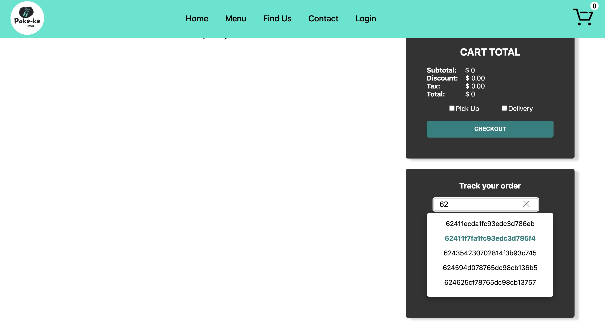

# Poke-ke Bowl
<a herf="https://pokeke-bowl.vercel.app">

</a>
  

Check out the website link here: [Poke-ke](https://pokeke-bowl.vercel.app)

# Description 
Poke-ke Bowl is a web restaurant with capabilities of checkout and delivery option. 

* Using Next.js the React framework for production.
* Upload image using cloudinary. 
* Create login account or using social media login and authentication through Auth0.
* Using MongoDB to store database.

* Start with the Home page. From this page there is a slider that provides promotions of the restaurant and list of Poke menu.


* User can pick any poke products and apply them to the cart.


* User have the options to pay with cash, using paypal or credit card payment.


* After checkout user will be direct to an order page. From this page user are able to track the status of their order. The order id tracker is also available in cart checkout page.




* User can create their account to view their order's history by sign up with Auth0 login page or login with social media account in this case using Google and Facebook.


* After login admin is able to create, edit and delete the poke list item. Admin is allowed to track all orders and can update the status through the admin page.


* Poke-ke bowl is mobile friendly responsive.


# Built With
* [Next.js](https://nextjs.org)
* [Auth0](https://auth0.com)
* [Cloudinary](https://cloudinary.com)
* [Javascript](https://developer.mozilla.org/en-US/docs/Web/JavaScript)
* [MongoDB](https://www.mongodb.com)
* [Mongoose](https://mongoosejs.com)

# Installation instructions
1. Clone the repo
   ```sh
   git clone https://github.com/Winnie59/Poke-ke-Bowl
   ```
2. Install all NPM packages
   ```sh
   npm install

# Wire Frames


# Contact

Winnie Bolm 
* [Winnie Bolm LinkedIn](https://www.linkedin.com/in/winniebolm/) 
* winnie.bolm@gmail.com

# Improvement
- Add delete items from cart function.
- Add create your own poke bowl option.
- User should be able to recieve the email notification after submit their order.
- Update option for pick up or delivery.
- Update contact form.
- Using mapbox for finding restaurant location.
- Adjust discounts and tax calculations.
- Adjust credit card payment button. 